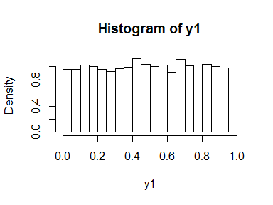
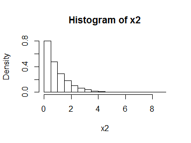
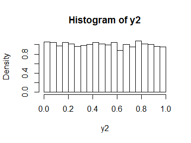

Introduction to copulas
================
Paul
10 January 2016

Here is a quote from Paul Sweeting's ERM book:

*"The marginal cumulative distributions are the inputs to the copula functions. These are essentially uniform distributions for each of the marginal variables."*

What does this second sentence mean? Let's start with a univariate normal distribution. Suppose we generate a bunch of normal random variable and plot the histogram.

``` r
x1 <- rnorm(10000)
hist(x1, freq = FALSE, breaks = 30)
```

<!-- -->

If we feed these back into cumulative distrribution function, we generate a uniform distribution.

``` r
y1 <- pnorm(x1)
hist(y1, freq = FALSE, breaks = 30)
```

<!-- -->

Of course, this doesn't only work for the normal, it works for any distribution. For example:

``` r
x2 <- rexp(10000)
hist(x2, freq = FALSE, breaks = 30)
```

<!-- -->

``` r
y2 <- pexp(x2)
hist(y2, freq = FALSE, breaks = 30)
```

<!-- -->

This is what the next sentence means:

*"They do not rely on the marginal distributions, which could have any form, since they are the probabilities derived from these distributions."*

If you remember the inverse transform method for generating random variables, this might look strangely familiar. In the inverse transform method we go the other way. So to convert our uniform random variables back to the normal distribution we just do:

``` r
z1 <- qnorm(y1)
hist(z1, freq = FALSE, breaks = 30)
```

<!-- -->

It looks like we've just gone round in a circle and achieved rather little. But let's look at some code that does something very similar in a bivariate situation. (The code below comes from <https://dahtah.wordpress.com/2011/10/28/hello-world/> and could do with being tidied up.)

First we generate a pair of bivariate normal random variables and plot them.

``` r
library(mvtnorm)
library(psych)
S <- matrix(c(1, 0.7, 0.7, 1), 2, 2) #Correlation matrix
xy <- rmvnorm(mean=c(0,0), sig=S, n=10000)
pairs.panels(xy)
```

<!-- -->

``` r
uv <- pnorm(xy)
pairs.panels(uv)
```

<!-- -->

We have already done most of the work to simulate a Gaussian copula: the (two-dimensional) distribution fuction of uv is just that.

the code below plots it.

``` r
rast <- 25
Cgau<- matrix(0, nrow = rast, ncol = rast)
for (i in 1:rast){
  ci <- uv[uv[,1] <= i/rast,]
  for (j in 1:rast){
    Cgau[i, j] <- sum(ci[, 2] <= j/rast)
  }
}
persp(z=Cgau, theta=100, phi = 25, col = "skyblue", shade = 0.3)
```

<!-- -->

We can look at the correlation coefficients through the three steps and see that they are preserved (note the use of Kendal's tau as the measure of correlation - try changing the code to look at the behaviour of Pearson's rho and Spearman's rho).

``` r
cor(xy[,1], xy[,2], method ="kendall")
```

    ## [1] 0.490854

``` r
cor(uv[,1], uv[,2], method ="kendall")
```

    ## [1] 0.490854

The copula captures the dependency structure of the original data, as indicated above (more about this later), but we can work with different marginals while retaining the same dependency. Suppose we want to work with gamma marginals - we simply make the transformation:

``` r
x1 <- qgamma(uv[,1],shape = 2, scale = 1) 
y1 <- qgamma(uv[,2],shape = 4, scale = 1)
pairs.panels(cbind(x1,y1))
```

<!-- -->

The transformation leaves Kendall's rank correlation unchanged (although the Pearson correlation coefficient rather ostentateously shown in the upper right boxes of the pairs plots is different from the original bivarate normal.)

``` r
cor(x1, y1, method ="kendall")
```

    ## [1] 0.490854
